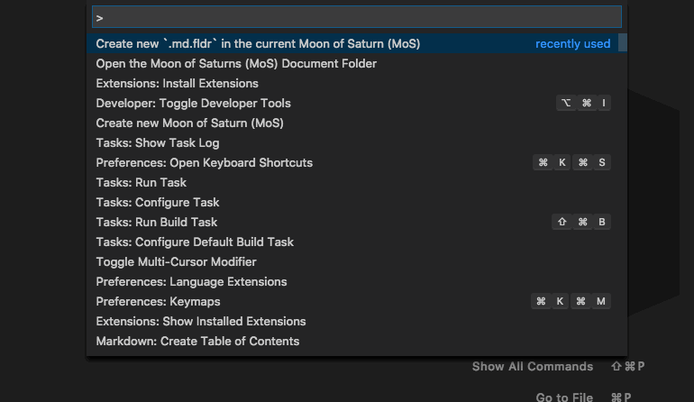

# moons-of-saturn-markdown-suite README

Stephen Eidson's vscode markdown suite which could one day be generic enough to be of use for other users than just himself

## Features

### Open your MoS notes in a new vscode instance

### Create a new document in the current MoS

<!-- ## Extension Settings

Include if your extension adds any VS Code settings through the `contributes.configuration` extension point.

For example:

This extension contributes the following settings:

* `myExtension.enable`: enable/disable this extension
* `myExtension.thing`: set to `blah` to do something -->

## Release Notes

### 0.0.3

Add validation to user input for new md file creation

### 0.0.2

Add ability to create new `${filename}.md.fldr/${filename}.md` in the current MoS

### 0.0.1

Initial Store Release with the ability to open the default MoS folder
