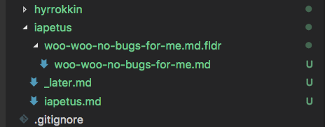

# moons-of-saturn-markdown-suite README

Stephen Eidson's vscode markdown suite which could one day be generic enough to be of use for other users than just himself

## Features

### Open your MoS notes in a new vscode instance

### Create a new document in the current MoS

### Start a new sprint by creating a new MoS

<!-- ## Extension Settings

Include if your extension adds any VS Code settings through the `contributes.configuration` extension point.

For example:

This extension contributes the following settings:

* `myExtension.enable`: enable/disable this extension
* `myExtension.thing`: set to `blah` to do something -->

## Special Thanks

* To [Chamestudio Pvt Ltd][0] for licensing [the icon][1] MoS uses under [CC BY 3.0][2]

<!-- Links -->

[0]: https://www.iconfinder.com/chamedesign
[1]: https://www.iconfinder.com/icons/1012847/astrology_galaxy_planet_ring_saturn_solar_system_universe_icon
[2]: http://creativecommons.org/licenses/by/3.0/